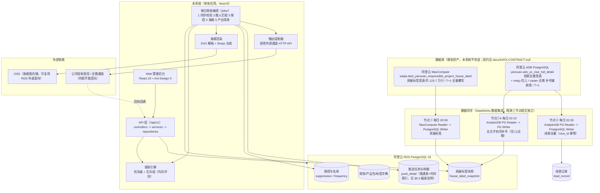
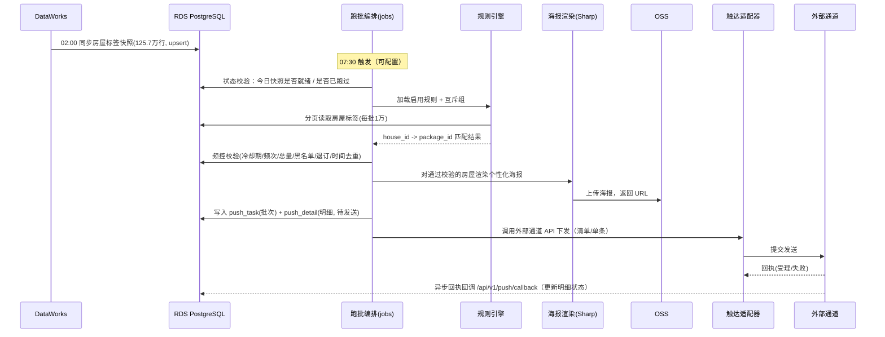
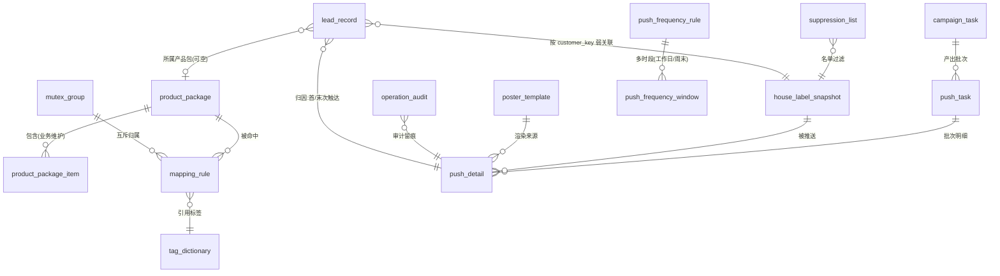
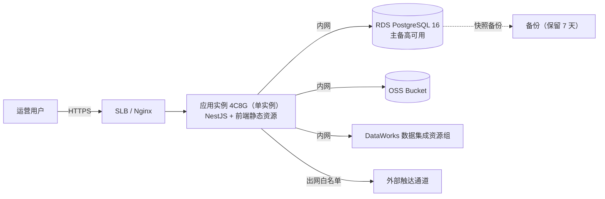
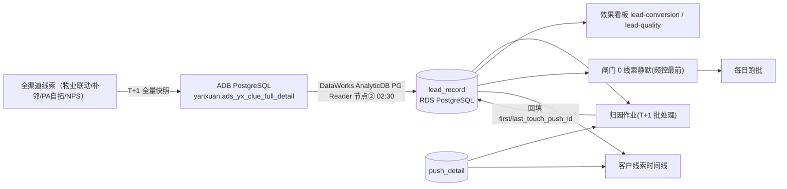
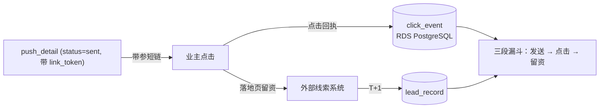

# 架构设计 — 房屋责任盘营销闭环系统 MVP

> 版本：v1.0 | 日期：2026-09-18 | 作者：高见远（首席架构师）
> 输入依据：`docs/PROJECT-BRIEF.md`、`docs/decisions/OPEN-DECISIONS.md`
> 本文档为技术契约，Phase 2 前后端实现以本文档 + `openapi.yaml` 为准。
> 范围声明：一期做「标签圈选 → 映射匹配 → 海报生成 → 触达下发 → 记录/重推 → **线索联动与效果归因**（线索静默闸门 0、客户线索时间线、效果看板）」，即**已包含效果回流与线索闭环**（见 §15）；不含「C 端触点、消息队列/微服务/大数据平台、多租户 SaaS」。

---

## 1. 设计目标与硬边界

| 目标 | 落地方式 |
|------|----------|
| 把四段线下流程串成系统 | 单一 Web 后台 + 一个每日跑批作业，不拆分服务 |
| 产品包 × 标签映射可维护 | 规则 + 互斥组配置化，带命中预览 |
| T+1 自动圈人推品 | 每日一次跑批，数据源 MaxCompute 快照 |
| 个性化海报 | 模板套版 + 变量填充，后端图像合成 |
| 频控是一等功能 | 时间窗、冷却期、频次、总量、黑白名单在**产出待发送清单前**统一校验 |
| 有记录、可重推 | 推送任务与明细落库，支持单条/批次重推 |

**明确不做（Out-of-Scope，出现即范围蔓延）**

- 不自建短信/企微通道（走公司现有通道，外部团队拉通），只产出数据出口 + 任务/记录
- 不做 SKU / 价格 / 库存 / 订单，不做商品中心
- 不做消息队列集群、不做微服务拆分、不做大数据平台（不引入 Kafka / Flink / Hive 层）
- 不做 C 端触点（海报落地页归外部）；线索侧**只做「同步 → 关联 → 归因 → 看板」的效果回流**（一期已含，见 §15），不做归因之外的深度行为分析
- 不做多租户 SaaS（内部单一组织，数据权限按「大区/城市/营业部」行级过滤即可）

**关键假设（待用户确认，对应 PRD R1）**

> 假设 A1：**一个房屋在一个推送周期内只推一个产品包**（即规则匹配按「优先级 + 互斥」收敛为唯一 `package_id`）。
> 本架构的数据模型与规则引擎**已按「单包/周期」定型**：`mapping_rule` 命中后经互斥归并 + 优先级取一，`push_detail` 每行只承载一个 `package_id`。若用户确认需支持「同一房屋同一周期推多个产品包」，则需改造为「匹配结果集为多包、明细表按 (house, package) 拆多行、频控按包分别计数」，属**结构性变更**，须先改 Spec 再改实现。

> 假设 A2：**线索数据与关联键（原 blocking-external，已确认 → 解除阻塞）**。
> 证据见 `docs/DATA-CONTRACT.md` §4-§5：线索源为既有 ADB PostgreSQL `yanxuan.ads_yx_clue_full_detail`（T+1 全量）；一期无统一客户 ID，关联键采用**归一化手机号 HMAC-SHA256**（ADR-013 一级方案），房屋用 pride/战图双键回落；无手机号时 `customer_key_type='house_only'` 仅参与房屋级关联。
> 残余风险：手机号换绑/一号多房导致误关联——以看板「归因覆盖率」、双键命中分布持续暴露；线索同步滞后 > 2 天时闸门 0 fail-open + 告警（`lead_gate_fail_mode`），功能不得假装可用。

---

## 2. 系统架构图



**分层依赖铁律**（技术栈无关，强制）：`routes/controllers -> services -> repositories -> DB`，依赖只向下；controller 不直连数据库；service 不接触 HTTP 对象、不返回响应；repository 不含业务逻辑；入口文件（`main.ts`）只装配。

---

## 3. 技术选型矩阵

> 评分口径：5 分制。权重按「学习成本 / 生态成熟度 / 部署成本 / 团队熟悉度」综合，MVP 阶段不评估三年扩展性。
> 版本号均为**调研时点（2026-09-18）官方来源的真实版本**，落地时以 `package.json` / 实例实际版本锁定。

### 3.1 后端框架与语言

| 候选 | 版本 | 学习成本 | 分层强制力 | 生态 | 部署成本 | 综合 |
|------|------|----------|-----------|------|----------|------|
| **NestJS（Node.js）** | NestJS 11.2.x / Node.js 22 LTS | 中 | 高（DI + Module 天然分层） | 高 | 低（单容器） | **选中** |
| FastAPI（Python） | FastAPI 0.11x / Python 3.12 | 中 | 中（需自律） | 高 | 低 | 备选 |
| Express 5（Node.js） | Express 5.x | 低 | 低（需自律分层） | 高 | 低 | 备选 |

**结论：NestJS 11.2.x + TypeScript 5.x + Node.js 22 LTS。**
理由：本项目核心复杂度在「配置化规则 + 定时跑批 + 明确分层」，NestJS 的 Module/DI 与 `@nestjs/schedule` 让分层与定时任务开箱即用，与团队 P0 代码组织规范（单文件 ≤300 行、入口只装配）天然对齐；TypeScript 全栈统一，前端可直接复用后端 DTO 类型。
备选：若团队 Python 更强或后续要重度使用 Python 数据生态，改用 FastAPI（分层同上，`app/api` + `app/services` + `app/repositories`）。详见 ADR-001。

### 3.2 数据库

| 候选 | 版本 | 125.7 万行跑批 | 规则 JSON 存储 | 分区/归档 | 与 MaxCompute 同生态 | 综合 |
|------|------|----------------|----------------|-----------|---------------------|------|
| **RDS PostgreSQL** | 阿里云 RDS PG 16（18 可选） | 强（毫秒-秒级聚合） | 强（JSONB + GIN） | 强（声明式分区 + pg_partman） | 强（DataWorks 原生 Writer） | **选中** |
| MySQL | RDS MySQL 8.0 | 强 | 中（JSON 支持较弱） | 中（需插件/手工） | 强 | 备选 |
| SQLite | 3.4x | 弱（写入锁） | 弱 | 无 | 无 | 否决 |
| 云开发数据库（MongoDB 类） | — | 中 | 强 | 中 | 弱 | 否决 |

**结论：阿里云 RDS PostgreSQL 16。**
理由：① 规则条件用 `JSONB` 存储 + GIN 索引，改动规则无需 DDL；② PG 具备声明式分区能力作为未来容量储备（**一期按项目硬约束不启用 `PARTITION BY`，普通表+时间索引，见 §6.3 偏差声明**）；③ DataWorks 数据集成原生支持 PostgreSQL Writer，同步链路最短；④ 与 MaxCompute 同地域同 VPC，走内网免公网流量费。SQLite 因每日百万级跑批 + 并发读写被直接否决。详见 ADR-002。

### 3.3 前端框架与 UI 组件库

| 候选 | 版本 | 管理后台适配 | 表格/表单深度 | Design Token | 综合 |
|------|------|-------------|--------------|--------------|------|
| **React + Ant Design** | React 19.x + antd 5.x + Vite 7.x | 强 | 强（Table 虚拟滚动/Form 校验） | 强（ConfigProvider theme token） | **选中** |
| Vue 3 + Element Plus | Vue 3.5 + Element Plus 2.x | 强 | 强 | 中 | 备选 |
| Next.js 15 | Next 15.x + antd 5.x | 中（SSR 对本项目无收益） | 强 | 强 | 否决 |

**结论：React 19.x + Ant Design 5.x + Vite 7.x + TypeScript。**
注意坑：React 19 与 antd 5 需引入官方兼容包 `@ant-design/v5-patch-for-react-19`，并在应用入口引入一次，否则 `Modal/Message/Notification` 静态方法与波纹特效失效（hooks 调用方式不受影响）。详见 ADR-003。

### 3.4 SVG 图标库（锁定一套，全项目不得混用）

> 团队 P0 规则：禁止 emoji 作为功能图标，必须锁定单一 SVG 图标库。

| 候选 | 版本 | 图标数 | 描边可调 | Tree-shaking | React 支持 | 综合 |
|------|------|--------|----------|--------------|-----------|------|
| **Lucide** | `lucide-react@^1.44.0` | 1500+ | 支持（`strokeWidth`） | 支持（命名导出） | 官方一等公民 | **锁定** |
| Tabler Icons | `@tabler/icons-react@^3.x` | 5900+ | 支持 | 支持 | 官方 | 备选 |
| Heroicons | `@heroicons/react@^2.x` | 292（outline/solid） | 不支持 | 支持 | 官方 | 备选 |
| Phosphor | `@phosphor-icons/react@^2.x` | 7700+（6 种字重） | 字重切换 | 支持 | 官方 | 备选 |

**锁定结论：Lucide（React 包 `lucide-react`，写文档时最新为 1.44.0，锁定 `^1.44.0`；Vue 栈对应 `lucide-vue-next@^1.x`）。**

安装与规范：

```bash
# 以 React + lucide-react 为例（示例，非指定；若前端改用 Vue 则替换为 lucide-vue-next）
npm install lucide-react@^1.44.0
```

| 规范项 | 约定 |
|--------|------|
| 栅格 | 24x24 viewBox，默认 `stroke-width=2`，`fill=none`，`stroke=currentColor` |
| 尺寸档位 | **16px（行内/表格）/ 20px（按钮/表单）/ 24px（导航/卡片标题）**，仅这三档，不得自造尺寸 |
| 颜色 | 一律 `currentColor` 继承文本色，禁止在图标上写死颜色 |
| 引入方式 | 必须**命名导入**（`import { Bell } from 'lucide-react'`），禁止整包/动态全量导入（破坏 tree-shaking） |
| 禁止事项 | 禁止 emoji 替代图标；禁止多图标库混用；禁止把图标当装饰性图片放大超过 24px（需要大图用插画，不用图标） |
| 无障碍 | 装饰性图标加 `aria-hidden="true"`；承载语义的图标必须有 `aria-label` |

### 3.5 定时任务 / 调度方案

| 候选 | 版本 | 持久化 | 多实例安全 | 运维成本 | 综合 |
|------|------|--------|-----------|----------|------|
| **应用内 cron** | `@nestjs/schedule@^6.x`（匹配 Nest 11） | 无（靠 DB 幂等） | 靠 PG 咨询锁 | 极低 | **选中** |
| BullMQ | `bullmq@^5.x` + Redis | 有 | 原生 | 中（需 Redis） | 备选 |
| DataWorks 调度 + 云函数触发 | — | 有 | 原生 | 低 | 备选 |

**结论：`@nestjs/schedule` 应用内 cron 触发 + 数据库级幂等锁（PostgreSQL advisory lock / 唯一约束）。**
理由：用户明确「一天推一次」「不上消息队列集群」，引入 Redis + BullMQ 是过度设计。跑批任务本身**必须幂等**（同一天重复触发不得重复推送），用 `campaign_task(stat_date)` 唯一约束 + `pg_advisory_lock` 保证单实例执行。部署必须**单实例**或对跑批加锁（见 §11 部署建议）。
升级路径：若未来需要「重试 / 死信 / 并发 worker」，再引入 BullMQ（届时同步引入 Redis），不改业务代码结构。详见 ADR-005。

### 3.6 AI 海报生成方案

| 候选 | 单张成本 | 单张耗时 | 中文文字准确度 | 品牌可控性 | 综合 |
|------|----------|----------|----------------|-----------|------|
| **模板套版 + 变量填充（后端合成）** | 约 0 元（自有算力） | 20–200 ms | 高（字体渲染，文字零错字） | 高（模板即品牌规范） | **选中** |
| 生成式出图 API（通义万相） | 约 0.2 元/张 | 数秒（异步任务） | 中（中文易错字/糊字） | 低（构图不可控） | 可选增强 |
| 无头浏览器截图（Puppeteer） | 低 | 300–600 ms，内存 200–400 MB/实例 | 高 | 高 | 否决（运维重） |

**结论：模板套版 + 变量填充，后端用 Sharp 合成。**
理由（对齐用户「业务可控性与成本优先」）：① 营销海报含社区名、主推产品、联系方式等**必须零错字**，生成式中文渲染不可控；② 成本随发送量线性增长——若日发 5000 张，生成式约 0.2 元/张 ≈ 1000 元/天 ≈ 3 万元/月，模板套版接近零边际成本；③ Sharp（libvips）合成 SVG 文本层 + 背景图约 20–200 ms/张、单请求内存约 15 MB，远优于无头浏览器。
实现：海报模板在后台配置（背景图 + 变量占位 `{{community_name}}`、`{{product_name}}`、`{{copy_slogan}}`），跑批时按承载数据填充并渲染为 PNG/JPEG，落 OSS。
**生成式出图定位为可选增强**：可由运营用生成式 API 批量产出背景图素材池，人工审核后入库作为模板背景，不在跑批链路内。详见 ADR-006。

### 3.7 标签数据同步方式（MaxCompute → 本系统）

| 候选 | 125.7 万行全量可行性 | 跑批耦合 | 成本 | 稳定性 | 综合 |
|------|---------------------|----------|------|--------|------|
| **DataWorks 数据集成 → RDS PostgreSQL** | 可行（并发通道，分钟级） | 低（本系统只读库） | 低（同 VPC 内网） | 高 | **选中** |
| DataWorks 导出 → OSS CSV → 本系统导入 | 可行 | 中（需自建导入） | 低 | 高 | 备选 |
| 本系统直连 MaxCompute（pyodps / Tunnel） | 勉强可行 | 高（每次全表扫描） | 高（计算资源消耗） | 低（会话易超时） | 否决 |

**结论：DataWorks 数据集成定时同步 MaxCompute → RDS PostgreSQL，本系统只消费库内快照。**
理由：① DataWorks 官方「批量同步节点」每次只能导一张表，需为每张上游表各建一个节点，但 125.7 万行在并发通道下分钟级可完成；② 本系统与 MaxCompute 解耦——MaxCompute 抖动不影响系统可用性，跑批只读本地 PG；③ 直连查询被否决：MaxCompute 面向批量分析而非高并发点查，每次跑批全表扫描既慢又烧计算资源，且 Tunnel 下载会话有生命周期，长任务会报 `download session is expired`（阿里云官方 FAQ 已说明）。
注意坑：RDS 默认不开公网，DataWorks 与 RDS 须同 VPC，且要把 DataWorks 数据集成资源组所在交换机网段加入 RDS 白名单，否则连通性测试失败；同步任务「脏数据」阈值默认 0，任一条不合法即整任务失败，建议设合理阈值（如 100）并旁路落库排查。详见 ADR-007。

> **真实资产校准（DATA-CONTRACT §1，覆盖本节早期单源设想）**：实际存在**两个数据源、三个同步节点**，抽取 SQL 已落 `sql/dw_01 ~ dw_03`：
> | 节点 | 时间 | 链路 | 目标 | 关键口径 |
> |------|------|------|------|----------|
> | ① 房屋标签 | 02:00 | MaxCompute Reader → PG Writer | `house_label_snapshot`（先落 staging 再 merge 组装 labels JSONB） | 源表无分区，`stat_date` 节点打标；多值标签是逗号串非数组 |
> | ①b 手机号补号 | 02:10 | **AnalyticDB PG Reader** → PG Writer | `house_mobile_resolve`（staging） | 住儿（pride 码）优先 > 企微；merge 算密文+HMAC 后清明文 |
> | ② 线索 | 02:30 | **AnalyticDB PG Reader** → PG Writer | `lead_record`（`clue_id` 幂等 upsert） | 同步层仅排测试数据+责任盘；质量翻译与维修向口径见 §15 / DATA-CONTRACT §4.2 |
>
> 三节点相互独立：标签/补号失败只影响圈人与可下发号码覆盖率（< 70% 只允许预览不允许发送）；线索失败/滞后只影响闸门 0 与归因（按 `lead_gate_fail_mode` fail-open + 告警）；二者均不阻塞对方。跑批 07:30 前置校验两源就绪状态。

### 3.8 选型汇总（一屏速览）

| 层 | 选型 | 版本 | 备选 |
|----|------|------|------|
| 后端 | NestJS + TypeScript | NestJS 11.2.x / Node.js 22 LTS | FastAPI / Express 5 |
| 数据库 | 阿里云 RDS PostgreSQL | 16（18 可选） | RDS MySQL 8.0 |
| 前端 | React + Ant Design + Vite | React 19.x / antd 5.x / Vite 7.x | Vue 3 + Element Plus |
| 图标库 | Lucide（**锁定**） | `lucide-react@^1.44.0` | Tabler / Heroicons / Phosphor |
| 调度 | `@nestjs/schedule` + PG 幂等锁 | `@nestjs/schedule@^6.x` | BullMQ + Redis |
| 海报 | SVG 模板 + Sharp 合成 | `sharp@^0.34.x` | 通义万相（可选增强） |
| 数据同步 | DataWorks 数据集成 → RDS | — | OSS CSV 中转 |
| 图存储 | 阿里云 OSS | — | 本地盘（不推荐） |
| ORM | Prisma | 6.x（锁定 package.json 实际版本） | TypeORM |
| 契约 | OpenAPI 3.0（`openapi.yaml`） | 3.0.3 | — |

---

## 4. Design Token 契约（颜色必须走 Token，禁止硬编码）

> 规则：业务与组件代码中**只允许**引用 `var(--*)` 等 token 变量；唯一例外是 `#fff` / `#000`。禁止紫色→粉色渐变主视觉。
> **token 名称与取值以 `docs/UIUX.md` §4 为唯一事实源**（设计师已产出并完成对比度校验）；本架构只锁定**契约**：token 语义名固定、组件不得硬编码、不得新增第二套色板。下表为架构侧消费的 token 契约清单（取值与 UIUX.md 保持一致，落地以 UIUX.md 为准）。

| Token | 取值（对齐 UIUX.md） | 用途 |
|-------|---------------------|------|
| `--bg` | `#F5F7FA` | 页面背景 |
| `--surface` | `#FFFFFF` | 卡片/容器 |
| `--surface-sunken` | `#EEF1F5` | 表头/只读区 |
| `--fg` | `#131A22` | 主文本 |
| `--fg-2` | `#3D4854` | 二级文本 |
| `--muted` | `#5B6675` | 次级文本/表头 |
| `--meta` | `#8A94A3` | 三级文本（仅时间戳/脚注） |
| `--primary` | `#1D5A96` | 品牌主色：主按钮/当前导航 |
| `--primary-hover` | `#17497B` | 主按钮悬停 |
| `--primary-active` | `#123A61` | 主按钮按下 |
| `--primary-subtle-bg` | `#E8F0F8` | 选中行/选中导航底 |
| `--border` | `#DFE4EA` | 默认边框/分割线 |
| `--border-strong` | `#C7CFD8` | 输入框边框 |
| `--success` | `#0F7A48` | 推送成功 |
| `--warn` | `#B4530A` | 频控拦截/待处理 |
| `--danger` | `#B3261E` | 推送失败/互斥冲突 |
| `--info` | `#1D5A96` | 提示/进行中 |

间距与圆角：`--space-1..8`（4/8/12/16/24/32/40/48px）、`--radius-sm/md/lg`（4/8/12px）。图标尺寸 token：`--icon-sm:16px` / `--icon-md:20px` / `--icon-lg:24px`。
落地方式：以 antd `ConfigProvider theme={{ token, components }}` 注入，token 定义集中在 `src/theme/tokens.ts`，禁止散落；组件代码只允许引用 `var(--*)`。

---

## 5. 数据流（每日跑批链路）



时间窗约束：跑批产出清单在**可发送时段内才真正下发**；可发送时段为 1-N 段（默认 `10:00–12:00`、`15:00–18:00`），跑批可提前产出，由发送阶段按窗口排队节流（见 §8 频控）。

---

## 6. 数据库设计

### 6.1 ER 图



### 6.2 表清单

> 通用字段：每表含 `id bigserial`（或 `uuid`）、`created_at timestamptz`、`updated_at timestamptz`；软删除用 `deleted_at timestamptz`。

**（1）`product_package` 产品包**

| 字段 | 类型 | 说明 |
|------|------|------|
| id | bigserial PK | |
| code | varchar(64) UNIQUE | 产品包编码（业务唯一键） |
| name | varchar(128) | 产品包名称 |
| description | text | 描述 |
| status | varchar(16) | enabled / disabled |
| product_items_text | text | 关联产品清单（业务方自由文本维护，系统不解析） |

索引：`UNIQUE(code)`、`(status)`。

**（2）`product_package_item` 产品包-产品明细**（可选结构化，MVP 允许仅用 `product_items_text`）

| 字段 | 类型 | 说明 |
|------|------|------|
| package_id | bigint FK | 产品包 |
| item_name | varchar(128) | 产品名 |
| item_desc | text | 卖点描述（用于海报文案变量） |
| sort_order | int | 排序 |

索引：`(package_id, sort_order)`。

**（3）`tag_dictionary` 标签字典**（供规则配置下拉与校验，与宽表列一一对应）

| 字段 | 类型 | 说明 |
|------|------|------|
| id | bigserial PK | |
| tag_group | varchar(64) | 标签组：water/electric/appliance/env/price/residence/family/decoration/repair/house/org |
| tag_key | varchar(64) | 宽表列名，如 `bathroom_leak` |
| tag_name | varchar(128) | 中文名，如「卫生间漏水」 |
| value_type | varchar(16) | enum / number / string |
| enum_values | jsonb | 枚举取值列表（value_type=enum / multi_enum 时） |
| min_value / max_value | numeric | 数值范围提示（number 时） |
| source_column | varchar(64) NULL | **上游真实列名（MaxCompute 拼音列，如 `shuilu_label`）**；同步映射与问题溯源用；GAP 未接入标签为 NULL（如 `house_feature_tags`）。DATA-CONTRACT §3 |

> `value_type` 实际枚举：`enum`（单值）/ `multi_enum`（上游 `wm_concat` 逗号串，同步拆数组、规则用 `contains_any`）/ `number` / `string`。

索引：`UNIQUE(tag_key)`、`(tag_group)`。

**（4）`mapping_rule` 映射规则**

| 字段 | 类型 | 说明 |
|------|------|------|
| id | bigserial PK | |
| name | varchar(128) | 规则名 |
| package_id | bigint FK | 命中后推荐的产品包 |
| priority | int | **数字越小优先级越高**，全表统一排序 |
| mutex_group_id | bigint FK NULL | 所属互斥组（可空） |
| condition_logic | varchar(8) | AND / OR（MVP 默认 AND，OR 预留） |
| condition_json | jsonb | 条件数组，见 §7.2 |
| status | varchar(16) | enabled / disabled |
| remark | text | 备注 |

索引：`(status, priority)`、`(mutex_group_id)`、`(package_id)`、`GIN(condition_json)`（可选，供按标签反查规则）。

**（5）`mutex_group` 互斥组**

| 字段 | 类型 | 说明 |
|------|------|------|
| id | bigserial PK | |
| name | varchar(128) | 组名，如「防水类产品包互斥」 |
| mode | varchar(16) | **MVP 仅 `single`**（组内最多命中一个，取优先级最高）。`all`（组内多命中）为预留值，**一期不实现、不暴露运营 UI**；若未来启用须走 ADR 变更 |
| status | varchar(16) | enabled / disabled |

**（6）`house_label_snapshot` 房屋标签快照**（约 125.7 万行，只保留最新一份）

| 字段 | 类型 | 说明 |
|------|------|------|
| house_id | varchar(64) PK | 房屋唯一键（**pride 蝶发码**，来自宽表 `code`） |
| zhantu_house_id | varchar(64) NULL | 战图房屋编码（宽表 `house_code`，备用关联键，DATA-CONTRACT §2） |
| house_name | varchar(128) | 房屋名称（宽表 `name`） |
| community_id | varchar(64) | 项目/责任盘（宽表 `asset_code`） |
| community_name | varchar(128) | 小区名（海报变量，宽表 `asset_name`） |
| region/city/branch/station | varchar(64) | 大区/城市分公司/营业部/服务站（数据权限，宽表 `region_name/city_group_name/business_name/fwz_org`） |
| station_code | varchar(64) | 服务站编码（宽表 `fwz_org_code`） |
| owner_name_masked | varchar(64) | 业主名（脱敏存储；**标签宽表暂无业主名字段，GAP 待补，一期可为空**） |
| contact_mobile_enc | text | 联系方式（**加密存储**，仅下发给通道时解密；**标签宽表不含手机号，由补号节点 merge 写入，见（16）**）；无号码为 NULL，跑批记 `NO_MOBILE` 不下发 |
| customer_key_hash | varchar(128) | 首选号码的归一化 HMAC-SHA256（与 `lead_record.customer_key` 同算法同密钥），跑批闸门与归因用 |
| labels | jsonb | 全部标签键值对（多值标签已拆为数组；家庭结构带 A_~E_ 前缀；环境值「渗水/返潮」，DATA-CONTRACT §3） |
| stat_date | date | 快照日期 |
| synced_at | timestamptz | 入库时间 |
| label_version | varchar(32) | 标签口径版本（便于排查口径变更） |

索引：`PK(house_id)`、`(stat_date)`、`(region, city, branch, station)`、`GIN(labels jsonb_path_ops)`（用于按标签抽样/预览）。
说明：**不存历史全量快照**（125.7 万 × 365 天 ≈ 4.6 亿/年，无必要）。每日同步用 `INSERT ... ON CONFLICT (house_id) DO UPDATE` 覆盖。若业务确需历史标签追溯，另建 `house_label_history` 按 `stat_date` 月分区并设保留期 90 天。

**（7）`campaign_task` 每日跑批任务**

| 字段 | 类型 | 说明 |
|------|------|------|
| id | bigserial PK | |
| stat_date | date UNIQUE | 跑批对应的数据日期（**幂等键**，唯一约束防重复跑） |
| status | varchar(16) | pending/running/success/failed/partial |
| started_at / finished_at | timestamptz | |
| scanned_count | int | 扫描房屋数 |
| matched_count | int | 规则命中数 |
| suppressed_count | int | 被频控/名单过滤数 |
| queued_count | int | 进入待发送数 |
| error_message | text | 失败原因 |

**（8）`push_task` 推送批次**

| 字段 | 类型 | 说明 |
|------|------|------|
| id | bigserial PK | |
| campaign_task_id | bigint FK | 归属跑批 |
| channel | varchar(24) | sms / wecom（通道类型，由外部团队定义枚举） |
| msg_type | varchar(16) | **marketing / notice**（消息类型标记：营销类受全部频控；服务/通知类不受频控，见 §8） |
| total_count | int | 批次总量 |
| success_count / failed_count | int | 结果统计 |
| halted_count | int | 被中止（未下发）的明细数 |
| lead_count | int | **批次级线索计数**（归因作业回填）：本批次明细中已归因关联到的线索数（去重按 lead_id）。供看板首屏与批次下钻显示，避免设计师只能给入口、渲染不出数字 |
| status | varchar(16) | queued/sending/done/partial/failed/**halted** |
| halted_at | timestamptz NULL | 中止时刻 |
| halted_by | bigint NULL | 中止操作人 |
| halt_reason | varchar(255) NULL | 中止原因（操作人填写） |

索引：`(campaign_task_id)`、`(status, created_at)`。

**（9）`push_detail` 推送明细**（**一期普通表，不使用声明式分区，见 §6.3 偏差声明**）

| 字段 | 类型 | 说明 |
|------|------|------|
| id | bigserial | |
| push_task_id | bigint FK | 批次 |
| house_id | varchar(64) | 房屋 |
| msg_type | varchar(16) | marketing / notice（冗余自批次，便于频控统计按类型过滤） |
| package_id | bigint FK | 推荐产品包 |
| rule_id | bigint FK | 命中规则（可追溯） |
| poster_template_id | bigint FK | 海报模板 |
| poster_url | text | 海报 OSS 地址 |
| contact_mobile_enc | text | 加密手机号（随机 IV，**不可用于关联**） |
| customer_key_hash | varchar(128) | **确定性关联键**：归一化手机号的 HMAC-SHA256（固定密钥）。与 `lead_record.customer_key` 同算法，用于线索归因 join 与闸门0 判重。**注意：加密手机号因随机 IV 无法 join，必须用此确定性哈希** |
| status | varchar(16) | queued/sent/failed/suppressed/halted/resent/**deferred** |
| fail_reason | varchar(64) | 失败原因码（通道失败时） |
| reason_code | varchar(32) NULL | **原因码（一期 14 个）**：LEAD_PACKAGE_COOLDOWN / LEAD_HOUSE_COOLDOWN（闸门 0a/0b，排最前）/ **NO_MOBILE（闸门 0c，数据缺口非频控，看板分列）** / HOUSE_COOLDOWN / PACKAGE_COOLDOWN / HOUSE_DAILY_CAP / HOUSE_WEEKLY_CAP / HOUSE_MONTHLY_CAP / OUT_OF_WINDOW / BLOCKED_WINDOW / GLOBAL_CAP_DEFERRED / OPT_OUT / BLACKLIST / HOLIDAY_SKIP |
| deferred_until | date NULL | **顺延标记**：被全局上限/窗口顺延的目标日期（status=deferred 时必填） |
| defer_count | int | 连续顺延次数（用于「多次顺延告警」，默认 0） |
| lead_count | int | **明细级线索计数**（归因作业回填）：该明细作为首触或末触归因到的线索数（默认 0）。供明细下钻显示「这条推送带来了几条线索」 |
| channel_msg_id | varchar(128) | 外部通道消息 ID（回执对账） |
| is_resent | boolean | 是否重推 |
| resent_from_id | bigint NULL | 重推来源明细 id |
| sent_at | timestamptz | 实际发送时间 |
| created_at | timestamptz NOT NULL DEFAULT now() | 创建时间（时间索引与归档基准；一期非分区键） |

物理实现：**普通表（项目硬约束：不用 `PARTITION BY`）**，`created_at timestamptz NOT NULL DEFAULT now()`；时间范围查询走 `(created_at)` B-tree 索引，归档/分区方案待数据量实测触顶后另立 ADR 评估（§6.3）。
索引：`(push_task_id)`、`(created_at)`、`(house_id, created_at)`、`(status)`、`(package_id)`、`(channel_msg_id)`、**`(customer_key_hash, created_at)`（归因 join 与时间线用）**。

> **状态口径（禁止合并统计）**：`suppressed`（频控主动保护，系统正常）、`failed`（通道异常，需排查）、`halted`（用户决策止损）三者语义不同，**任何报表/看板/质量指标都不得把它们合并成一个「未成功」**——合并会让运营复盘时误判通道质量。同理 `deferred`（顺延）也不等于失败。

**（10）`push_frequency_rule` 频控规则**（可配置，全局或按产品包）

| 字段 | 类型 | 说明 |
|------|------|------|
| id | bigserial PK | |
| scope_type | varchar(16) | global / package |
| package_id | bigint FK NULL | scope_type=package 时生效 |
| house_cooldown_days | int | 同一房屋冷却期（N 天不重复推），**默认 7** |
| package_cooldown_days | int | 同一产品包冷却期，**默认 30** |
| house_daily_cap | int | 同一房屋每日上限，**默认 1** |
| house_weekly_cap | int | 同一房屋每周上限，**默认 2** |
| house_monthly_cap | int | 同一房屋每月上限，**默认 4**（月度维度） |
| global_daily_cap | int | 全局每日发送上限，**默认 5000**（可按渠道/大区分别配置） |
| cross_channel_count | boolean | 是否**跨渠道合并计数**（默认 true，建议保持 true）。**计数锚点是「房屋」而非渠道**：同一房屋当日短信 + 企微合并计 1 次；若按渠道分计，业主会当日收到 2 次打扰 |
| effective_lookback_days | int（只读，派生） | 回看窗口**由各维度参数自动推导，不作为可配置项**（见 §8「回看窗口」）。仅回传供 UI 展示与排查 |
| holiday_skip | boolean | 节假日是否跳过（**P1 可选，默认 false**，保持行为可预期） |
| lead_package_cooldown_days | int | **闸门0a·线索静默同包长冷却**（默认 90，1-365；命中 `LEAD_PACKAGE_COOLDOWN`，重推不可覆盖） |
| lead_house_cooldown_days | int | **闸门0b·线索静默客户级冷却**（默认 15，1-90；命中 `LEAD_HOUSE_COOLDOWN`，重推不可覆盖） |
| lead_gate_fail_mode | varchar(8) | 线索数据缺失/过期（`max(synced_at)` 滞后 > 2 天）时闸门0策略：`open`（默认，跳过闸门继续跑批但显著告警+任务标注）/ `closed`（暂停营销下发） |
| status | varchar(16) | enabled / disabled |

索引：`(scope_type, status)`；部分唯一索引 `(scope_type) WHERE scope_type='global'`（全局仅一条，种子 `sql/04_frequency_seed.sql` 随附）。

> 字段命名与默认值**以 `docs/PRD.md` §8 为准**（上表已对齐 PRD：`house_cooldown_days`=7、`package_cooldown_days`=30、`house_daily_cap`=1、`house_weekly_cap`=2、`house_monthly_cap`=4、`global_daily_cap`=5000）。
> **发送时段不再用单对字段表达**，改由子表 `push_frequency_window` 承载（对应 PRD 的 `send_windows`，一对多，支持多段与工作日/周末不同策略）。原 `send_window_start` / `send_window_end` 字段废弃。

**（10a）`push_frequency_window` 可发送时段子表**（对应 PRD `send_windows`，一对多）

| 字段 | 类型 | 说明 |
|------|------|------|
| id | bigserial PK | |
| frequency_rule_id | bigint FK | 归属频控规则 |
| day_type | varchar(16) | all / weekday / weekend / holiday（默认 all，即工作日与周末同一套策略；**分日策略为 P1 可选**） |
| window_start | time | 时段起（含） |
| window_end | time | 时段止（含）；允许跨天段（如 `19:30–21:00`，`21:00–23:00` 之外；跨天段须 `start < end` 语义按同日处理；如需跨 0 点另设 `cross_day` 标记） |
| enabled | boolean | 是否启用该时段 |
| sort_order | int | 展示与优先级顺序 |

索引：`(frequency_rule_id, day_type, window_start)`。

> 语义：某日 `day_type` 匹配的**所有启用时段取并集**为当日可发送窗口；**多段自动合并重叠**（保存时做区间合并，落库为合并后的不重叠段）。默认 `[10:00–12:00, 15:00–18:00]`。落在窗口外跳过并记原因码 `OUT_OF_WINDOW`，未发送项顺延到下一窗口。

**（10b）禁发时段 `blocked_windows`（合规硬编码，非可配置表）**

- 固定为 **22:00–次日 08:00**，**代码级常量，不入库、不可配置、不可关闭**（合规要求），手动重推同样不可越过。
- 命中即拒绝下发，原因码 `BLOCKED_WINDOW`。
- 前端只读展示（架构在频控规则响应中回传该常量供 UI 显示），禁止提供编辑入口。

**（11）`suppression_list` 退订/黑白名单**

| 字段 | 类型 | 说明 |
|------|------|------|
| id | bigserial PK | |
| list_type | varchar(16) | unsubscribe / blacklist / whitelist |
| target_type | varchar(16) | mobile / house_id |
| target_value | varchar(128) | 值（手机号加密或 house_id） |
| source | varchar(64) | 来源：manual / channel_callback / import |
| expires_at | timestamptz NULL | 过期时间（可空=永久） |

索引：`UNIQUE(list_type, target_type, target_value)`、`(target_value)`。

**（12）`poster_template` 海报模板**

| 字段 | 类型 | 说明 |
|------|------|------|
| id | bigserial PK | |
| name | varchar(128) | 模板名 |
| package_id | bigint FK NULL | 绑定产品包（可空=通用） |
| width / height | int | 像素尺寸 |
| background_oss_key | text | 背景图 OSS key |
| svg_spec | jsonb | 变量布局（见 §7.4），占位符 `{{var}}` 与坐标/字号 |
| status | varchar(16) | draft / published / archived |

索引：`(package_id, status)`。

**（13）`operation_audit` 操作审计**

| 字段 | 类型 | 说明 |
|------|------|------|
| id | bigserial PK | |
| operator_id | bigint | 操作人 |
| action | varchar(64) | rule.create / push.resent / frequency.update 等 |
| target_type / target_id | varchar(32) / varchar(64) | 操作对象 |
| before_json / after_json | jsonb | 变更前后（含敏感字段脱敏） |
| ip | inet | 来源 IP |

索引：`(operator_id, created_at)`、`(action, created_at)`。

**（14）`daily_send_counter` 每日发送计数**（用于全局上限快速判定，可由 `push_detail` 聚合替代）

| 字段 | 类型 | 说明 |
|------|------|------|
| stat_date | date PK | |
| sent_count | int | 当日已发送数 |
| updated_at | timestamptz | |

**（15）`lead_record` 线索记录**（ADB 线索宽表 T+1 同步，本系统只读消费 + 回填归因字段；字段级映射见 DATA-CONTRACT §4）

| 字段 | 类型 | 说明 |
|------|------|------|
| lead_id | varchar(64) PK | 外部线索系统主键（业务唯一键，**不用自增**，避免与外部对不上） |
| customer_key | varchar(128) NOT NULL | **统一客户键**（跨系统关联键）：归一化手机号 HMAC 哈希 / 统一 ID |
| customer_key_type | varchar(16) NOT NULL | `mobile_hash`（有手机号，HMAC 关联，一级方案）/ `house_only`（无手机号有 pride 码，仅房屋级）/ `unified_id`（预留，一期无源）/ `unmatched`（两者皆无，进失败池） |
| house_id | varchar(64) NULL | 能映射到房屋时回填（可空，外部未必带） |
| product_package_id | bigint FK NULL | 所属产品包（**映射到本系统字典后**的包 id，可空。对应 PRD `lead_package_id` / UIUX `package_id`） |
| external_package_code | varchar(64) NULL | 外部提供的**原始包编码**（未映射到本系统字典）。用于区分「集成问题（有码但字典对不上）」与「上游问题（无码）」 |
| package_source | varchar(16) NOT NULL DEFAULT 'none' | 产品包来源：`external`（外部直接提供且已映射）/ `inferred`（外部未给，本系统按归因结果推断：取 `first_touch_push_id` 对应推送的包）/ `none`（无来源）。**推断来源必须打标记**，看板按此区分统计，不混算准确率 |
| lead_grade | varchar(16) NULL | 线索等级（外部口径原样保存：源 `customer_level`，A类客户~E类客户） |
| lead_status | varchar(24) NULL | 线索状态（外部口径原样保存：源 `business_status`，动态枚举不翻译） |
| lead_quality | varchar(8) NULL | **本系统翻译的四级质量**：A/B/C/无效（DATA-CONTRACT §4.2 固定翻译表，写死代码；源线索表无此列，merge 时派生） |
| is_valid_for_reno | boolean | 装修向有效线索标记（自营+非维修+非家政+状态有效；刷新/浴改淋指标口径） |
| is_valid_for_repair | boolean | 维修向有效线索标记（`is_repair='是'`；**渗漏包指标口径，勿与装修口径混用**） |
| house_match_type | varchar(16) NULL | 房屋关联方式：`pride` / `zhantu_fallback` / NULL（失败池）。DATA-CONTRACT §2 |
| stale_in_source | boolean NOT NULL DEFAULT false | 源端全量重灌后消失的线索打此标记，不物理删除（线索是效果资产） |
| latest_deal_at | timestamptz NULL | 最近成交时间（源 `latest_deal_time`，成交是最高质量信号） |
| order_cnt | int NOT NULL DEFAULT 0 | 成交单数（源 `order_cnt`） |
| performance_amount | numeric(18,2) NULL | 业绩金额（源 `performance_final`） |
| source_channel | varchar(24) NULL | 来源渠道（源 `channel_category_l1`：物业联动/朴邻联动/PA自拓/NPS） |
| first_touch_push_id | bigint NULL | **归因**：窗口内首次触达的 `push_detail.id`（回填） |
| last_touch_push_id | bigint NULL | **归因**：窗口内最近一次触达的 `push_detail.id`（回填） |
| attribution_window_days | int NULL | 归因窗口快照（回填时所用值，**常量 15，不可配置**） |
| attributed_at | timestamptz NULL | 归因回填时间（NULL = 尚未归因） |
| lead_created_at | timestamptz NOT NULL | 线索产生时间（外部） |
| stat_date | date NOT NULL | 数据日期（T+1） |
| synced_at | timestamptz NOT NULL | 同步入库时间（**数据新鲜度校验依据**） |
| created_at / updated_at | timestamptz | |

索引：
- `PK(lead_id)`
- `(customer_key, lead_created_at DESC)` —— 客户时间线 + 闸门0 判重（核心）
- `(customer_key, product_package_id, lead_created_at DESC)` —— 同包长冷却（闸门 0a）
- `(product_package_id, lead_created_at)` —— 看板按产品包分组
- `(lead_created_at)` —— 时间范围筛选
- `(house_id)`、`(first_touch_push_id)`、`(last_touch_push_id)` —— 反查
- `(lead_grade)`、`(lead_status)` —— 质量分布
- `(package_source)` —— 看板按来源拆分统计（外部/推断）

说明：
- 量级远小于 `push_detail`（仅产生线索的客户，千–万级/月），**MVP 不分区**；若单表超千万再按月分区（`lead_created_at`）。
- `customer_key` 必须与 `push_detail.customer_key_hash` **同算法同密钥**，否则归因与闸门0 全部失效（见 §15.5 降级方案 R2）。
- 本表为**只读镜像 + 归因回填**：`first/last_touch_push_id`、`attributed_at`、`attribution_window_days` 由本系统归因作业写入，其余字段以外部为准（同步时覆盖）。
- **产品包来源（`package_source`）的判定链**：外部给了包编码 -> 命中本系统字典则 `external`、写 `product_package_id`；未命中则保留 `external_package_code`、`product_package_id` 空、来源记为 `none`（**集成问题**）。外部没给包编码 -> 本系统按 `first_touch_push_id` 推断：推断成功 `inferred`（写 `product_package_id`），推断不出（`none`）。
- **来源影响闸门 0 分级**：`external` / `inferred`（有包）-> 走两级冷却（同包 90 天 / 客户级 15 天）；`none`（无包）-> **退化为单一房屋级冷却 15 天**（不做同包长冷却）。看板两种「未映射」口径**分别单列、均不并入任何产品包桶**（详见 §15.3 与 UIUX §8.6）。

**（15a）`lead_attribution_run` 归因作业记录**（可选，用于可观测与重跑）

| 字段 | 类型 | 说明 |
|------|------|------|
| id | bigserial PK | |
| stat_date | date | 归因对应的数据日期（唯一，幂等） |
| window_days | int | 本次使用的归因窗口 |
| lead_scanned | int | 扫描线索数 |
| attributed | int | 成功回填数 |
| unattributed | int | 无匹配触达数（**归因失败必须可见**） |
| status | varchar(16) | running/success/failed |
| error_message | text | |

索引：`UNIQUE(stat_date)`。

**`lead_record` DDL（PostgreSQL 16）**

```sql
CREATE TABLE lead_record (
  lead_id                  varchar(64)  PRIMARY KEY,
  customer_key             varchar(128) NOT NULL,
  customer_key_type        varchar(16)  NOT NULL,
  house_id                 varchar(64),
  product_package_id       bigint REFERENCES product_package(id),
  external_package_code    varchar(64),
  package_source           varchar(16)  NOT NULL DEFAULT 'none'
                             CHECK (package_source IN ('external','inferred','none')),
  lead_grade               varchar(16),
  lead_status              varchar(24),
  lead_quality             varchar(8),            -- 本系统翻译：A/B/C/无效（DATA-CONTRACT §4.2）
  is_valid_for_reno        boolean NOT NULL DEFAULT false,  -- 装修向有效线索口径
  is_valid_for_repair      boolean NOT NULL DEFAULT false,  -- 维修向有效线索口径（渗漏包）
  house_match_type         varchar(16),           -- pride / zhantu_fallback / NULL
  stale_in_source          boolean NOT NULL DEFAULT false,
  latest_deal_at           timestamptz,
  order_cnt                int NOT NULL DEFAULT 0,
  performance_amount       numeric(18,2),
  source_channel           varchar(24),
  first_touch_push_id      bigint,
  last_touch_push_id       bigint,
  attribution_window_days  int,
  attributed_at            timestamptz,
  lead_created_at          timestamptz NOT NULL,
  stat_date                date NOT NULL,
  synced_at                timestamptz NOT NULL,
  created_at               timestamptz NOT NULL DEFAULT now(),
  updated_at               timestamptz NOT NULL DEFAULT now()
);

-- 时间线 + 闸门0 判重（核心）
CREATE INDEX idx_lead_customer_time ON lead_record (customer_key, lead_created_at DESC);
-- 闸门 0a：同包长冷却
CREATE INDEX idx_lead_customer_pkg_time ON lead_record (customer_key, product_package_id, lead_created_at DESC);
-- 看板：按产品包 / 时间分组
CREATE INDEX idx_lead_pkg_time ON lead_record (product_package_id, lead_created_at);
-- 看板：按产品包来源拆分统计（外部/推断/无）
CREATE INDEX idx_lead_pkg_source ON lead_record (package_source);
CREATE INDEX idx_lead_time ON lead_record (lead_created_at);
-- 反查与质量分布
CREATE INDEX idx_lead_house ON lead_record (house_id);
CREATE INDEX idx_lead_touch_first ON lead_record (first_touch_push_id);
CREATE INDEX idx_lead_touch_last ON lead_record (last_touch_push_id);
CREATE INDEX idx_lead_grade ON lead_record (lead_grade);
CREATE INDEX idx_lead_status ON lead_record (lead_status);
CREATE INDEX idx_lead_quality ON lead_record (lead_quality);
CREATE INDEX idx_lead_house_match ON lead_record (house_match_type);
```

> `push_detail` 侧同步新增 `customer_key_hash varchar(128)` 与索引 `(customer_key_hash, created_at)`（见 §6.2（9）），作为与 `lead_record.customer_key` 的 join 键。

**（16）`house_mobile_resolve` 业主手机号补号结果**（DATA-CONTRACT §5 落地表；节点①b 同步 + 系统 merge）

| 字段 | 类型 | 说明 |
|------|------|------|
| house_id | varchar(64) | pride 房屋编码（= 标签宽表 `code`） |
| mobile_enc | text | 号码密文（随机 IV；**明文 merge 后即清，禁止留存**） |
| customer_key_hash | varchar(128) | 归一化 HMAC-SHA256（同 ADR-013 密钥） |
| mobile_masked | varchar(32) | 脱敏展示号 `138****5678` |
| mobile_source | varchar(16) | `rich`（住儿注册，优先级 1）/ `qywx`（企微，优先级 2）/ `crm`（预留 3） |
| is_preferred | boolean | 同房屋多号时的首选号（merge 写入 snapshot 的那一个） |
| resolved_at | timestamptz | 取号时间 |

索引：`(house_id, is_preferred)`、`UNIQUE(house_id, customer_key_hash)`（同屋同号去重）、`(mobile_source)`。
同一房屋多成员号码全部留存；频控按**号码 HMAC 与房屋双锚点**计数；无首选号的房屋参与规则预览与统计但不下发，原因码 `NO_MOBILE`。上线前覆盖率门槛 ≥ 70%（DATA-CONTRACT §8 Q1）。

### 6.3 分区与归档策略

> **实现偏差声明（遵从项目硬约束：PostgreSQL 不使用声明式分区 `PARTITION BY`）**：
> 下表中 `push_detail` / `operation_audit` 的「按月 RANGE 分区 + pg_partman」为**早期设计，工程一期不实现**；
> 一期统一采用**普通表 + `created_at` B-tree 索引（必要时含分区裁剪友好的复合索引前缀）+ 定期 `DELETE`/归档作业**。
> 待单表数据量或查询性能实测触顶（经验值：单表 > 2000 万行或时间范围查询明显劣化），再以 ADR 变更重新评估分区方案。

| 表 | 一期策略（实际实现） | 保留期 |
|----|------|--------|
| `house_label_snapshot` | 无分区，upsert 覆盖（常驻约 125.7 万行） | 永久（只存最新） |
| `push_detail` | **普通表（不用 PARTITION BY）**；索引 `(created_at)`、`(house_id, created_at)`、`(customer_key_hash, created_at)` 等；按月归档作业后置评估 | 热数据 12 个月，超量再评估归档/分区 |
| `operation_audit` | 普通表 + `(created_at)` 索引 | 24 个月 |
| `campaign_task` / `push_task` | 不分区（日增 1 行 / 天） | 永久 |
| `lead_record` | 不分区（量级小，千–万级/月） | 永久（线索是效果资产，不归档） |

---

## 7. 规则引擎（优先级 + 互斥）与海报渲染

### 7.1 匹配流程

1. **加载**：一次性加载 `status=enabled` 的全部规则与互斥组（量级：几十~几百条，内存常驻）。按 `priority` 升序排序（数字小=高优先）。
2. **扫描**：分页读取 `house_label_snapshot`（每批 1 万行），逐行评估。
3. **评估**：对每条规则评估 `condition_json`（AND 组合，短路求值）。
4. **择优**：
   - 收集该房屋命中的全部规则。
   - 先按**互斥组**归并：同组内只保留 `priority` 最小的那条。
   - 再在剩余候选中取 `priority` 最小的规则，其 `package_id` 即该房屋的推荐产品包。
5. **产出**：`house_id -> (package_id, rule_id)` 写入内存结果集，进入频控校验。
6. **确定性与可解释**：结果只由 `priority` 决定，平级时以 `rule_id` 升序兜底，保证同输入同输出（可回归）。

### 7.2 条件结构（`condition_json`）

```json
{
  "logic": "AND",
  "conditions": [
    { "tag": "water_tags", "op": "contains_any", "value": ["卫生间漏水", "厨房漏水", "阳台漏水", "水管老化"] },
    { "tag": "decorate_status", "op": "in", "value": ["5-10年", "未装修"] }
  ]
}
```

> 上例即渗漏检测包在种子 `sql/03_mapping_rule_seed.sql` 中的真实规则。标签键与取值必须取自 `tag_dictionary`（家庭结构带 `A_`~`E_` 前缀、环境值「渗水/返潮」，DATA-CONTRACT §3）。

支持操作符：
- 多值标签（`multi_enum`，上游逗号串同步拆数组）：`contains_any`（有交集即命中，默认）/ `contains_all`；
- 单值枚举/字符串：`eq / neq / in / not_in / exists`；
- 数值：`gte / lte / between`。
空值/空数组对 `contains_any` 恒为 false。MVP 只做 AND（`OR` 字段预留但不推荐，避免规则互相掩盖导致不可解释）。

### 7.3 命中预览（可视化配置的核心）

- 接口：`POST /api/v1/rules/preview`
- 入参：规则草稿（条件 + 优先级 + 互斥组）+ 可选抽样范围（全量 / 指定大区 / 随机 N 条）
- 出参：预计命中数、命中样本（默认前 20 条，字段脱敏）、与其它启用规则的**冲突提示**（命中同一房屋的更高优先级规则清单）
- 性能保障：预览支持**抽样模式**（如随机 5 万条）秒级返回；全量预览走异步（返回 `preview_task_id`，轮询结果），避免阻塞 UI。

### 7.4 海报模板与渲染

- 模板 = 背景图（OSS）+ `svg_spec`（变量占位、坐标、字号、字体、颜色 token 引用）。
- 变量来源：`house_label_snapshot`（小区名、家庭结构、装修年限等）+ `product_package`（产品名、卖点）+ 规则配置的文案变量。
- 渲染：`Sharp` 将 SVG 文本层 compositing 到背景图，输出 PNG（文字清晰）或 JPEG（体积小），上传 OSS 返回 URL 写入 `push_detail.poster_url`。
- 字体：使用公司品牌许可字体，字体文件随镜像分发（避免运行时网络拉取）；`loadSystemFonts:false` 显式指定字体，保证多环境渲染一致。
- 兜底：渲染失败时降级为「默认模板 + 纯文本"，不得因海报失败阻断整条推送。

---

## 8. 频控校验逻辑（P0）

**作用域（重要）**：频控**只作用于营销类触达**（`push_task.msg_type = marketing`）。`msg_type = notice` 的服务/通知类消息（验证码、**维修进度**、缴费提醒、紧急通知）**不计入营销频控、不被频控拦截、不受禁发时段限制**——否则业主会收不到关键服务信息。判定依据是任务级 `msg_type` 标记，随下发 payload 携带。
**执行时机**：营销类在「规则命中之后、进入待发送清单之前」统一执行，任一不通过即标记 `suppressed`（或 `deferred`）并记录 `reason_code`，不进入发送队列。
**校验顺序与原因码总数（一期）**：`reason_code` 一期共 **14 个**取值（原 13 个 + `NO_MOBILE`，DATA-CONTRACT §7-#5 已锁定）。执行顺序为 **闸门 0（线索静默：0a → 0b）→ 闸门 0c（号码完备性）→ 闸门 1~11**。闸门 0 必须**排在最前**——它表达「该客户已经产生过线索，不该再被营销打扰」，语义优先级高于一切其它频控（冷却期、名单、上限、时段）。

按顺序校验（短路，越便宜越先算）：

| # | 校验项 | 实现 | 原因码 | 数据来源 |
|---|--------|------|--------|----------|
| **0a** | **线索静默·同包长冷却** | 该客户在 `lead_package_cooldown_days`（默认 90，可配）内**对同一产品包**产生过线索 -> 拦截该包推送（**不可被重推覆盖**）；`package_source=none` 无包线索不走本级，退化为仅 0b | `LEAD_PACKAGE_COOLDOWN` | `lead_record(customer_key, product_package_id, lead_created_at DESC)` |
| **0b** | **线索静默·客户级冷却** | 该客户在 `lead_house_cooldown_days`（默认 15，可配）内**对任意产品包**产生过线索 -> 拦截该客户全部营销推送（**不可被重推覆盖**） | `LEAD_HOUSE_COOLDOWN` | `lead_record(customer_key, lead_created_at DESC)` |
| **0c** | **可下发号码检查** | `house_label_snapshot.contact_mobile_enc`（或补号首选号）为空 -> 不进入下发清单；房屋照常计入规则命中与预览统计。**属数据缺口而非业主打扰风险，看板须与频控拦截分列** | `NO_MOBILE` | `house_label_snapshot` / `house_mobile_resolve`（DATA-CONTRACT §5，GAP-1） |
| 1 | 退订名单 | `unsubscribe` 命中 -> 拦截（**不可被重推覆盖**） | `OPT_OUT` | `suppression_list` |
| 2 | 黑名单 | `blacklist` 命中 -> 拦截（**不可被重推覆盖**） | `BLACKLIST` | `suppression_list` |
| 3 | 白名单优先 | 命中 `whitelist` 可豁免部分频控（可配置） | — | `suppression_list` |
| 4 | 同一家庭去重 | 按 `community_id + 门牌/地址指纹` 去重，一家庭只保留一条 | — | `house_label_snapshot` |
| 5 | 房屋冷却期 | 查 `house_id` 近 `house_cooldown_days`(7) 天是否有 `status in (sent, queued, deferred)`，有则拦截 | `HOUSE_COOLDOWN` | `push_detail(house_id, created_at)` |
| 6 | 产品包冷却期 | 查该房屋近 `package_cooldown_days`(30) 天是否推过同 `package_id` | `PACKAGE_COOLDOWN` | `push_detail(house_id, package_id, created_at)` |
| 7 | 房屋日/周/月上限 | 当日/当周/当月该房屋推送数 >= `house_daily_cap`(1)/`house_weekly_cap`(2)/`house_monthly_cap`(4) | `HOUSE_DAILY_CAP` / `HOUSE_WEEKLY_CAP` / `HOUSE_MONTHLY_CAP` | `push_detail` 聚合（受 `cross_channel_count` 约束；各维度独立回看，见下「回看窗口」） |
| 8 | 全局日上限 | `sent_count >= global_daily_cap`(5000) -> 当日停止剩余下发 | `GLOBAL_CAP_DEFERRED` | `daily_send_counter` |
| 9 | 可发送时段 | 当日 `day_type` 匹配的**多时段并集**内才下发；窗口外记 `OUT_OF_WINDOW` 并顺延下一窗口 | `OUT_OF_WINDOW` | `push_frequency_window` |
| 10 | 禁发时段（硬规则） | 落在 `blocked_windows`（22:00–次日 08:00，**不可配置、不可关闭、重推亦不可越过**）-> 拒绝下发 | `BLOCKED_WINDOW` | 代码常量 |
| 11 | 节假日策略 | `holiday_skip=true` 且当日为节假日 -> 跳过（可配置仅顺延或跳过） | `HOLIDAY_SKIP` | 节假日日历/配置 |

**回看窗口：各维度独立回看，禁止使用统一固定窗口（修正长冷却期静默失效）**

频控统计**不做统一 `lookback_days`**，每个维度按**自身参数**推导回看范围：

| 维度 | 回看范围 | 说明 |
|------|----------|------|
| 房屋冷却期 | `house_cooldown_days` 天 | 配 30 则回看 30 天 |
| 产品包冷却期 | `package_cooldown_days` 天 | 配 90/180 则回看 90/180 天 |
| 日上限 | 当日 00:00 起 | |
| 周上限 | 近 7 天 | |
| 月上限 | 近 30 天 | |

> 设计原因（防止 bug）：若用一个固定 30 天的统一回看窗口，而用户把 `package_cooldown_days` 配成 90/180 天，则 90 天前的推送历史落在窗口外，**长冷却期会静默失效**，同一产品包被重复推送。
> 因此**不保留可配置的 `lookback_days`**（结构性消除该误配），改为各维度按需回看；`effective_lookback_days`（= 各维度最大值，仅只读派生）仅供 UI 展示与排查。查询走 `push_detail(house_id, created_at)` 索引做范围扫描，各维度一次独立查询。

**拦截 vs 顺延的落地差异**（影响 `push_detail.status`）：
- 冷却期 / 频次上限 / 名单类：记 `status=suppressed` + `reason_code`，**不自动重发**（需运营手动重推）。
- 全局日上限：记 `status=deferred` + `reason_code=GLOBAL_CAP_DEFERRED` + `deferred_until`=次日 + `defer_count+1`；次日优先重试，**连续顺延超过阈值（建议 3 次）触发告警**。
- 窗口外：记 `reason_code=OUT_OF_WINDOW` 并顺延到下一窗口（同日下一窗口则保持 `queued`，跨日则转 `deferred`）。

**手动重推的覆盖边界**（对齐 PRD §8.5）：重推**可覆盖**冷却期与频次上限（需二次确认 + 强制留痕），**不可覆盖**线索静默（`LEAD_PACKAGE_COOLDOWN`/`LEAD_HOUSE_COOLDOWN`）、退订/黑名单（`OPT_OUT`/`BLACKLIST`）、禁发时段（`BLOCKED_WINDOW`）、全局日上限（`GLOBAL_CAP_DEFERRED`）。

**闸门 0「线索静默」：配置与降级（fail-open + 强告警）**

- 配置项（`push_frequency_rule` 扩展或独立配置）：`lead_package_cooldown_days`（默认 90）、`lead_house_cooldown_days`（默认 15）、`lead_gate_fail_mode`（`open`/`closed`，默认 **open**）。
- **数据新鲜度校验**：闸门 0 执行前先看 `lead_record.max(synced_at)`；若滞后超过阈值（建议 2 天），标记闸门状态为「线索数据过期」。
- **降级策略（关键）**：当线索表拿不到 / 未就绪 / 过期时，按 `lead_gate_fail_mode` 处理：
  - `open`（默认）：**跳过闸门 0 继续跑批**，但必须在 `campaign_task` 与看板上**显著标注「线索数据缺失/过期，线索静默未生效」并告警**——绝不静默跳过（否则运营会误以为已判重）。
  - `closed`：暂停营销下发并告警（用于「宁可少发也不能骚扰已有线索客户」的场景，由运营显式选择）。
- 无论哪种模式，**降级状态必须可见**（任务详情 + 看板横幅），且 `lead_attribution_run.status` 与告警联动。

**分批节流（`batch_throttle`）：系统级内部常数，不进运营 UI**

- 语义：触达通道的**限流保护**，不是营销业务策略。默认「每批 500 条 / 间隔 5 分钟」（可在 100–2000 条、1–30 分钟区间由运维/通道适配器配置）。
- 落地：**系统部署配置**（环境变量/通道适配器配置文件），**运维可见、运营不可见**；不出现在运营后台表单、不进 openapi 运营接口、不进入任何运营可写 API。理由：暴露给运营只增加误配面，且误配的后果是通道侧限流/封禁，属工程责任而非业务责任。
- 与频控的关系：节流只控制**下发节奏**，不改变「是否发」的判定；频控决定哪些明细进入队列（`queued`），节流决定队列以什么速率提交通道。

**「无互动降频」（`no_engagement_pause`）：一期不做，列为二期（依赖效果回流）**

- PRD 期望：连续 N 次无互动 → 暂停 M 天（阈值 2–5 次、暂停 7–90 天）。
- **可行性判定：一期不可行**。判定「无互动」需要**互动/点击/回复回流数据**，而一期只拿到下发回执（受理/失败），没有互动信号（一期明确不做效果回流，见 PROJECT-BRIEF §4）。缺少数据源时，配了阈值也不会生效。
- 处置：**一期契约完全不涉及**——配置字段（阈值/暂停天数）与原因码**都不加入一期 schema/UI/枚举**。理由：契约里存在但不生效的枚举值最容易被误实现（后端会"顺手"写出永不触发、却被测试覆盖、被后来人误认为「已实现」的半成品逻辑）；一期的干净度优先。
- 二期启用时**字段 + 原因码 + UI 一并加**（届时走 ADR 变更）。不做「先放字段让运营配」——那会形成「配了没反应」的假配置。

并发与幂等：频控校验在**单实例跑批**内串行执行，避免「先查后写」竞态；`campaign_task.stat_date` 唯一约束 + PG 咨询锁 `pg_advisory_lock(hashtext('daily_campaign'))` 保证同一天不重复跑。手动重推走独立接口，重推**仍需过频控**（见上方覆盖边界），并在 `operation_audit` 留痕。

**停止发送 / 中止（与重推成对的反向操作）**

设计语义必须与通道物理能力一致，避免给用户「虚假承诺」：

| 环节 | 能否中止 | 系统行为 |
|------|----------|----------|
| 已进入队列、尚未提交通道（`queued`） | **可以** | 置为 `halted`，不再下发 |
| 已提交通道、下发中（在途） | **尽力而为** | 请求外部通道中止；以通道回执为准，可能仍发出 |
| 已送达（`sent`） | **短信不可撤回** | 不做任何撤回动作；短信为物理送达不可召回（企微若外部通道支持且有撤回时限，由适配器透传，成功与否以回执为准） |

结论：`POST /push-tasks/{id}/halt` 的**确定性语义**是「停止该批次中尚未下发的明细」（用户原话即「未发送的成员不再继续发送」），对已送达部分不承诺召回。中止为**不可逆停止**（如需继续，走重推）；中止不影响已 `sent` 明细，不改变其统计。所有中止写 `operation_audit`（action=`push.halt`）。这是团队已有的「触达通道由外部团队拉通」约束下的诚实边界——通道接口标准待确认后，若外部通道提供撤回 API，可由适配器补上「尽力撤回」，但不改变上述确定性语义。

---

## 9. API 端点清单

> 统一前缀 `/api/v1`；统一响应 `{ code, data, message }`（`code=0` 成功）；鉴权 `Authorization: Bearer <jwt>`。完整 schema 见 `docs/openapi.yaml`。

**认证**

| 方法 | 路径 | 说明 |
|------|------|------|
| POST | `/auth/login` | 登录，返回 JWT |
| GET | `/auth/me` | 当前用户与数据权限范围 |

**产品包**

| 方法 | 路径 | 说明 |
|------|------|------|
| GET | `/product-packages` | 列表（分页/筛选/搜索） |
| POST | `/product-packages` | 新建 |
| GET | `/product-packages/{id}` | 详情 |
| PATCH | `/product-packages/{id}` | 更新 |
| DELETE | `/product-packages/{id}` | 软删除 |

**标签字典**

| 方法 | 路径 | 说明 |
|------|------|------|
| GET | `/tags` | 标签字典（按 tag_group 分组） |
| GET | `/tags/{tagKey}/values` | 某标签的可选值/值域 |

**映射规则与互斥组**

| 方法 | 路径 | 说明 |
|------|------|------|
| GET | `/rules` | 规则列表（含优先级排序） |
| POST | `/rules` | 新建规则 |
| GET | `/rules/{id}` | 详情 |
| PATCH | `/rules/{id}` | 更新 |
| DELETE | `/rules/{id}` | 软删除 |
| PATCH | `/rules/reorder` | 批量调整优先级 |
| POST | `/rules/preview` | **命中预览**（抽样同步返回/全量异步） |
| GET | `/rules/preview/{taskId}` | 全量预览结果 |
| GET | `/mutex-groups` | 互斥组列表 |
| POST | `/mutex-groups` | 新建互斥组 |
| PATCH | `/mutex-groups/{id}` | 更新互斥组 |
| DELETE | `/mutex-groups/{id}` | 删除互斥组 |

**人群与跑批**

| 方法 | 路径 | 说明 |
|------|------|------|
| GET | `/campaigns` | 跑批任务列表 |
| GET | `/campaigns/{id}` | 跑批详情（扫描/命中/拦截/入队统计） |
| POST | `/campaigns/trigger` | 手动触发跑批（幂等，同日重复触发返回已有任务） |
| GET | `/campaigns/{id}/preview` | 预览本次待发送清单（分页，脱敏） |

**推送任务与明细**

| 方法 | 路径 | 说明 |
|------|------|------|
| GET | `/push-tasks` | 推送批次列表 |
| GET | `/push-tasks/{id}` | 批次详情（成功率统计） |
| POST | `/push-tasks/{id}/halt` | **停止发送 / 中止批次**（止损入口，与重推成对；中止该批次未下发的明细） |
| GET | `/push-details` | 明细查询（按房屋/产品包/状态/**原因码**/时间/批次筛选，拦截与被顺延项可见可追溯） |
| GET | `/push-details/{id}` | 明细详情（含海报、状态、失败原因） |
| POST | `/push-details/{id}/resend` | **单条重推** |
| POST | `/push-details/resend-batch` | **批次重推**（按筛选条件，异步执行并返回任务 id） |
| POST | `/push/callback` | **外部通道回执回调**（更新明细状态/失败原因/退订回流） |

**频控与名单**

| 方法 | 路径 | 说明 |
|------|------|------|
| GET | `/frequency-rules` | 频控规则列表 |
| PATCH | `/frequency-rules/{id}` | 更新频控规则 |
| POST | `/suppression-list` | 新增退订/黑白名单 |
| GET | `/suppression-list` | 名单查询 |
| DELETE | `/suppression-list/{id}` | 移除名单 |

**海报模板**

| 方法 | 路径 | 说明 |
|------|------|------|
| GET | `/poster-templates` | 模板列表 |
| POST | `/poster-templates` | 新建模板 |
| PATCH | `/poster-templates/{id}` | 更新模板 |
| POST | `/poster-templates/{id}/render-preview` | 模板预览渲染（传样本数据出图） |

**线索与效果归因**

| 方法 | 路径 | 说明 |
|------|------|------|
| GET | `/leads` | 线索列表（按 customerKey / houseId / packageId / leadGrade / leadStatus / 时间 / 是否已归因 筛选） |
| GET | `/leads/{leadId}` | 线索详情（含归因出的首次/末次触达推送与海报） |
| GET | `/customers/{customerKey}/timeline` | **客户/房源线索时间线**：线索事件 + 关联触达事件按时间轴合并，标注归因关系（满足「看到客户最近一次产生线索的时间」） |
| GET | `/customers/{customerKey}/lead-summary` | 客户线索摘要（最近一次线索时间、是否命中闸门 0、冷却剩余天数） |
| GET | `/analytics/lead-conversion` | **效果看板聚合**：发送 → 线索转化，`groupBy=package\|tag\|poster_template`，时间范围 + 归因口径（`first` / `last`）双口径 |
| GET | `/analytics/lead-quality` | 线索质量分布：`groupBy ∈ {package, tag, poster_template}`（维度）× `qualityBy ∈ {lead_grade, lead_status}`（质量口径），质量分布在同一 `groupBy` 下出，回答「每次发送后真实产生线索的质量（分产品包/标签/海报模板）」 |
| GET | `/analytics/attribution-runs` | 归因作业记录与未归因数（可观测） |

**审计**

| 方法 | 路径 | 说明 |
|------|------|------|
| GET | `/audits` | 操作审计查询 |

统一错误码：

| code | HTTP | 含义 |
|------|------|------|
| 0 | 200 | 成功 |
| 40001 | 400 | 参数校验失败 |
| 40100 | 401 | 未登录/Token 失效 |
| 40300 | 403 | 无权限（越权访问非本组织数据） |
| 40400 | 404 | 资源不存在 |
| 40900 | 409 | 冲突（编码重复 / 同日跑批已存在） |
| 42200 | 422 | 业务规则不满足（如互斥组被删除仍被引用） |
| 50000 | 500 | 服务内部错误 |
| 50301 | 503 | 外部触达通道不可用 |

---

## 10. 百万级数据性能估算

| 环节 | 量级 | 估算 | 依据/优化 |
|------|------|------|-----------|
| 数据同步（DataWorks） | 125.7 万行 | 分钟级（并发通道） | 官方数据集成并发 + 内网写入 |
| 快照 upsert 入库 | 125.7 万行 | 2–5 分钟 | `ON CONFLICT` 批量提交，每批 1 万 |
| 规则匹配 | 125.7 万 × 约 50 规则 | 约 30 秒–3 分钟 | 6250 万次布尔评估，短路求值；可用标签倒排预筛优化 |
| 频控校验（含闸门 0） | 命中数（万级） × 6~10 次索引查询 | 秒级–1 分钟 | 全部走索引；闸门 0 走 `lead_record(customer_key, ...)`；全局上限走计数器表 |
| 海报渲染 | 实际发送 5000 张 × 30–50 ms | 单核约 4 分钟，4 并发约 1 分钟 | Sharp/libvips；失败降级默认模板 |
| 线索同步入库 | 千–万级/月（日增量更小） | 秒级 | 复用 DataWorks 链路，量级远小于房屋快照 |
| 线索归因回填（T+1） | 当日新增线索 × 窗口内触达查询 | 秒级–分钟级 | 走 `lead_record(customer_key, lead_created_at)` + `push_detail(customer_key_hash, created_at)` 双索引 |
| 看板聚合查询 | 线索量（千–万级）× 按 groupBy 聚合 | 亚秒–秒级 | `groupBy ∈ {package, tag, poster_template}` 走 `lead_*` 与 `push_detail` 索引；`groupBy=tag` 需关联命中规则/标签，量级小可接受，必要时加物化视图/日汇总表（数据增长后再加）。质量分布在同一 groupBy 下出，不额外扫表 |
| 清单落库 + 下发 | 千–万级 | 分钟级 | 批量写 + 通道限流 |
| **整条跑批** | — | **预计 10–30 分钟** | 远低于「一天一次」的时间预算 |

结论：**当前量级下无需分库分表、无需大数据平台**。单台 4C8G 应用实例 + RDS PG 16（4C8G 起）即可承载。若未来发送量增长到数十万级/天，优先扩并发 worker 与海报渲染并行度，而非改架构。

---

## 11. 部署建议



| 项 | 建议 |
|----|------|
| 应用部署 | Docker 镜像，**单实例**（跑批依赖单实例锁）；如需多实例，跑批实例用开关隔离 |
| 容器 | 前端构建产物由应用静态托管或 Nginx 托管，降低部署复杂度 |
| 数据库 | RDS PostgreSQL 16 主备高可用，与 MaxCompute/DataWorks 同地域同 VPC |
| 网络 | DataWorks 资源组交换机网段加入 RDS 白名单；应用出口加白名单访问外部通道 |
| 环境变量 | 数据库连接串、OSS AK/SK、通道凭证、JWT 密钥一律走环境变量/密钥管理，禁止入库入库代码 |
| 日志与监控 | 跑批任务成功/失败告警（必配）；跑批耗时与拦截率监控；`push/callback` 失败重试告警 |
| 备份 | RDS 每日快照，保留 7 天；OSS 开启版本控制 |

**内嵌已知坑（写进实现规格，避免重踩）**

1. React 19 + antd 5 必须装 `@ant-design/v5-patch-for-react-19` 并在入口 import，否则静态方法失效。
2. DataWorks 批量同步节点**一张表一个节点**；RDS 默认无公网，须同 VPC + 白名单。
3. DataWorks 同步脏数据阈值默认 0，任一条非法即整任务失败；设合理阈值并旁路落库。
4. 直连 MaxCompute 的 Tunnel 下载会话有生命周期，长任务报 `download session is expired`；不要在本系统内做长时全表拉取。
5. PG 分区表的**唯一约束必须包含分区键**；不要给 `push_detail` 建全局唯一键。
6. 分区数控制在几十个（月粒度）；分区过多会拖慢查询计划（PG 官方建议避免上千分区）。
7. `lucide-react` 必须命名导入，禁止整包导入（破坏 tree-shaking，包体膨胀）。
8. Sharp 在容器内需与运行时架构一致，跨架构部署要 `npm rebuild sharp`；建议多阶段构建。
9. 加密存储的联系方式只在**下发瞬间解密**，日志与导出一律脱敏，避免合规风险。
10. 跑批必须幂等：`campaign_task.stat_date` 唯一约束 + 咨询锁，防止重复跑造成重复推送。
11. 频控**回看窗口必须各维度独立**，禁止用统一固定窗口（否则 `package_cooldown_days` 配长于窗口时冷却期静默失效）。
12. 频控**只作用于营销类**：服务/通知类必须携带 `msg_type=notice` 并跳过频控与禁发时段，否则业主漏收维修进度、验证码等关键信息。
13. 分批节流（`batch_throttle`）是**系统部署配置**（运维可见、运营不可见），不得暴露到运营 UI 表单或 openapi 运营接口。
14. `suppressed` / `failed` / `halted` / `deferred` 语义不同，**禁止在任何报表合并为一个「未成功」**，否则运营会误判通道质量。
15. **归因 join 键必须是确定性哈希**（归一化手机号 HMAC-SHA256，固定密钥），**不能用加密手机号**（随机 IV 导致无法 join）——这是「沉默逻辑错误」高发点，归因会静默地全为 0。
16. 闸门 0（线索静默）在**线索数据缺失/过期时必须 fail-open + 显著告警**，禁止静默跳过，否则运营会误判「已判重」。
17. `lead_record.customer_key` 与 `push_detail.customer_key_hash` **必须同算法、同归一化规则、同密钥**，否则归因与闸门 0 全部失效；这是外部依赖（见 §15 R2），须前置确认，不得假设成立。

---

## 12. 目录分层建议（强制，技术栈无关）

> 硬规则：单文件 ≤ 300 行（不含空行注释）；单一职责；按资源分包；入口只装配零业务；依赖只向下。

```text
# 后端 — 以 NestJS 为例（示例，非指定；FastAPI/Express 按同构分层组织）
src/
├── modules/                  # 按资源分包，每个资源 = controller + service + repository + dto
│   ├── auth/                 # 登录鉴权
│   ├── product-package/      # 产品包
│   ├── tag-dictionary/       # 标签字典
│   ├── mapping-rule/         # 映射规则 + 互斥组 + 命中预览
│   ├── campaign/             # 跑批任务
│   ├── poster/               # 海报模板 + 渲染
│   ├── push/                 # 推送任务/明细/重推/回执
│   ├── frequency/            # 频控规则 + 名单 + 闸门 0 线索静默
│   ├── lead/                 # 线索（列表/详情/客户时间线）
│   ├── analytics/            # 效果看板聚合（lead-conversion / lead-quality）
│   └── audit/                # 操作审计
│       ├── xxx.controller.ts  # 只做参数校验 + 调 service + 组装响应（≤150 行）
│       ├── xxx.service.ts     # 业务规则/事务编排（≤300 行）
│       ├── xxx.repository.ts  # 数据读写（Prisma），无业务逻辑
│       └── dto/               # 请求/响应 DTO + 校验 schema（独立成文件）
├── engine/                   # 规则引擎（纯函数，无 IO）：匹配算法、互斥归并
├── jobs/                     # 定时任务编排（只装配调用各 service，不含业务实现）
│   ├── daily-campaign.job.ts
│   ├── lead-attribution.job.ts   # 线索归因回填（T+1）
│   └── partition-maintenance.job.ts
├── adapters/                 # 外部通道适配器（隔离外部接口变化）
│   └── touch-channel.adapter.ts
├── common/                   # 过滤器/拦截器/守卫/异常/分页 DTO
├── infra/                    # Prisma service、配置、日志、加密工具
└── main.ts                   # 入口：只装配（挂中间件 + 路由 + 启动），< 100 行
```

```text
# 前端 — 以 React + Vite 为例（示例，非指定）
src/
├── pages/                    # 路由页面，只做组装
├── components/               # 通用组件（按功能拆分，图标统一来自 lucide-react）
├── features/                 # 业务模块（rules / campaigns / push / frequency / poster）
├── services/                 # API 调用统一封装（axios，按资源一文件一函数集）
├── stores/                   # 状态管理（按域拆分）
├── theme/                    # tokens.ts（Design Token 唯一定义处）
├── utils/                    # 纯函数
├── types/                    # 由 openapi.yaml 生成的类型
└── main.tsx                  # 入口：装配路由 + Provider（无业务）
```

自检门禁：`find src -name '*.ts' -o -name '*.tsx' | xargs wc -l | sort -rn | awk '$1>300'` 无输出；入口文件 < 100 行且不含业务。

---

## 13. 技术约束清单（供设计师与前端）

1. **图标**：全项目只用 Lucide，尺寸仅 16 / 20 / 24px，颜色用 `currentColor`；设计稿中不得出现 emoji 图标；不得出现其它图标库的图形。
2. **颜色**：一律使用 `docs/UIUX.md` §4 的 Design Token 语义名（如 `--primary` / `--success` / `--danger`），组件代码禁止硬编码颜色（例外 `#fff`/`#000`）；不得使用紫色→粉色渐变主视觉；不得新增第二套色板。
3. **状态语义固定**：成功 / 失败 / 频控拦截 / 互斥冲突分别映射 `--success` / `--danger` / `--warn` / `--danger`，全站一致。
4. **关键交互必须存在**：规则优先级拖拽排序 + 命中预览入口；推送明细的筛选与单条/批次重推按钮；频控规则的可视化配置表单。
5. **表格与分页**：明细表默认分页 20 条，支持按批次/状态/时间/产品包筛选；大数据量用虚拟滚动。
6. **空态与错误态**：每个列表页需有明确空态文案（无空洞占位文案），跑批失败需有明确失败原因展示。
7. **线索时间线页**（Phase 1 补充）：必须展示「客户最近一次产生线索的时间」、线索事件与触达事件合并时间轴，并标注归因口径（首发触达 / 末次触达）。
8. **效果看板必须显式标注「归因局限」**（Phase 1 补充）：一期无点击数据，「触达」指发送成功而非已查看（相关≠因果）；且必须展示 `unattributed`（未归因数）；若已按 §15.5 降级，须显示「弱归因 / 包级归因，不可用于个体判定」标识。禁止做出无标注的漂亮转化率。质量分布按维度（产品包 / 标签 / 海报模板）分组展示（`groupBy` × `qualityBy`）；`groupBy=tag` 多标签重复计数须提示占比之和可 >100%。批次/明细需展示线索计数（`leadCount`）。
9. **归因窗口为常量 15 天**（Phase 1 补充）：`LeadRecord.attributionWindowDays` 仅作回填快照只读展示，**不提供输入控件**；看板须说明「冷却期是闸门规则、归因窗口是统计口径，两者数值对齐但独立」。
10. **重推不得覆盖闸门 0（铁律，Phase 1 补充）**：手动重推**可**豁免冷却期与频次上限（`exemptCooldown` + 二次确认 + 强制留痕），**不可**覆盖线索静默（`LEAD_PACKAGE_COOLDOWN` / `LEAD_HOUSE_COOLDOWN`）、退订/黑名单（`OPT_OUT` / `BLACKLIST`）、禁发时段（`BLOCKED_WINDOW`）、全局日上限（`GLOBAL_CAP_DEFERRED`）——**一期不提供任何覆盖通道**，命中即拒（`42200`）。UI 不得渲染任何覆盖闸门 0 的开关（与 22:00–08:00 禁发时段同级硬约束）。
11. **产品包来源必须可区分（Phase 1 补充）**：`LeadRecord.packageSource ∈ {external, inferred, none}`；看板凡涉及产品包维度的指标必须按来源分开统计，**推断来源的准确性单独看，不得与外部提供的数据混算**；两类「未映射」（有码对不上字典 / 无码）**分别单列、均不并入任何产品包桶**。

---

## 14. 端到端验证步骤（规格收尾即验收）

**核心成功流**

1. 启动依赖：`docker compose up`（应用 + 本地 PG 16）；执行迁移 `npx prisma migrate deploy`。
2. 种子数据：导入 1 万条房屋标签样本、2 个产品包、3 条规则（含 1 个互斥组）。
3. 配规则：后台新建规则 A（优先级 10）、规则 B（优先级 20，与 A 同互斥组），调用 `POST /api/v1/rules/preview` 抽样，断言 A 命中数 ≥ B 且同房屋不重复计。
4. 触发跑批：`POST /api/v1/campaigns/trigger`（stat_date=今天），断言返回 `campaign_task` 且 `status=success`；再次调用同日，断言返回**同一任务**（幂等）。
5. 频控验证：对同一房屋连续触发两次跑批（不同日期），断言第二次该房屋被 `house_cooldown_days` 拦截、`suppressed_count > 0`。
6. 海报验证：断言命中明细均有 `poster_url`，下载后检查文字无乱码、变量已替换（可用 OCR 或比对模板变量）。
7. 下发与回执：桩接外部通道，断言 `push_detail.status` 由 `queued -> sent`；模拟失败回执，断言 `status=failed` 且 `fail_reason` 正确。
8. 重推：对一条 `failed` 明细调用 `POST /push-details/{id}/resend`，断言生成新明细 `is_resent=true`、`resent_from_id` 指向原明细，且 `operation_audit` 有记录。
9. 名单：把该房屋手机号加入退订，再跑批，断言该房屋被拦截且未进入清单。
10. 线索同步与闸门 0：写入 2 条 `lead_record`（客户 C1 对包 A、客户 C2 对包 B），其 `customer_key` 与对应 `push_detail.customer_key_hash` 一致；跑批后断言：C1 对包 A 的推送被 `LEAD_PACKAGE_COOLDOWN` 拦截、C2 的任意包推送被 `LEAD_HOUSE_COOLDOWN` 拦截，且 `reason_code` 正确写入。
11. 归因回填：对某条线索跑归因作业（`lead_attribution_run`），断言 15 天窗口（常量）内命中的 `first_touch_push_id` / `last_touch_push_id` 被正确回填、`attributed_at` 非空；对窗口外线索断言 `unattributed` 计数增加（归因失败可见）。看板 `GET /analytics/lead-conversion?groupBy=package` 数字与明细一致。

**关键错误/边界流**

- 今日快照未就绪时触发跑批 -> 返回 `40900`「数据未就绪」而非静默空跑。
- 规则条件引用已删除的标签键 -> 保存时 `42200` 校验失败。
- 外部通道不可用 -> 明细保持 `queued` 并告警，不误标 `sent`，支持后续重推。
- 发送窗口外（如 08:00）产出清单 -> 明细停留 `queued`，窗口开启后才下发。
- 对已入队批次调用 `POST /push-tasks/{id}/halt` -> 断言该批次 `queued` 明细全部转 `halted`、已 `sent` 明细不变、批次 `status=halted` 且 `halted_count` 正确、`operation_audit` 有 `push.halt` 记录；对已结束批次再调用返回 `40900`。
- **线索数据缺失/过期**（`lead_record.max(synced_at)` 滞后 > 2 天）-> 断言闸门 0 按 `lead_gate_fail_mode=open` 跳过、`campaign_task` 标注「线索静默未生效」、告警触发；**不得静默通过且无任何标记**。
- **`customer_key` 对不上**（线索侧键与推送侧哈希算法/密钥不一致）-> 断言归因结果为 0 且被 `unattributed` 计数与告警捕获，而非产出「看起来正常但全为 0」的看板（防沉默逻辑错误）。

**完成定义**：上述步骤全部通过 + 门禁（单文件 ≤300 行、入口无业务、无硬编码颜色、无 emoji 图标）全绿，方可进入实现验收。

---

## 15. 线索联动与效果归因（Phase 1 补充）

### 15.1 数据流



### 15.2 归因计算方案选型（结论：T+1 批处理回填为主 + 单客户实时时间线为辅）

| 候选 | 新鲜度 | 成本 | 可解释/可审计 | 适用场景 |
|------|--------|------|----------------|----------|
| A 实时查询（看板查询时 join） | 最新 | 高（跨分区 join、每线索扫窗口） | 中 | 单客户视角 |
| **B T+1 批处理回填（选中·主）** | T+1 | 低（一次作业，结果落库） | 高 | 聚合看板 + 闸门 0 |
| C 实时流式归因（事件驱动） | 秒级 | 高（需消息/流组件） | 中 | 秒级转化追踪 |

**结论：B 为主，叠加 C 的「单客户实时查询」**（`/customers/:key/timeline` 走索引实时查，成本低）。
理由：① 线索本身就是 T+1 数据，实时归因不会更准；② 推送也是 T+1 每日一次，业务不需要秒级；③ 看板是聚合查询，实时 join 会拖垮 OLTP 主库（与 ADR-002 单库定位冲突）；④ 回填结果落库后可审计、可重跑、可回归（防沉默逻辑错误）。详见 ADR-011。

### 15.3 归因口径

- **双写** `first_touch_push_id`（首次触达）与 `last_touch_push_id`（末次触达），支撑「首发功劳」与「末次功劳」两套看板口径。
- 归因窗口为**常量 15 天，不可配置**（`attribution_window_days` 仅作回填快照）：窗口 = `[lead_created_at - 15 天, lead_created_at]`，取该 customer 在此窗口内的 `push_detail`。**为何是 15 天**：客户级线索冷却期为 15 天，若窗口更短（如 7 天），会出现「线索在冷却期内产生、却不被任何一次发送认领」的口径撕裂，业务看到的就是「归因覆盖率莫名只有约 60%」且无法解释。上线后若数据显示 15 天系统性吃掉首触功劳，改这一个常量重新发布即可，**不进界面、不加配置项**（不重蹈 `lookback_days` 覆辙）。
- **窗口与冷却期「对齐但不同源」**：二者数值当前同为 15 天，但**语义不同、互相独立**——冷却期是**闸门规则**（决定「有线索时要不要继续推」），归因窗口是**统计口径**（决定「一条线索算窗口内哪几次推送的功」）。看板文案必须显式说明二者独立，不得让用户误以为是一回事。
- 未命中任何触达 -> 两个字段为 NULL 且计入 `lead_attribution_run.unattributed`（**归因失败必须可见，不静默**）。
- **产品包来源与两类「未映射」（`package_source`，对齐 PRD §12.7 / UIUX §8.6）**：`external`（外部提供且已映射）/ `inferred`（外部未给，本系统取 `first_touch_push_id` 对应推送的包推断）/ `none`（无包）。
  - **两类未映射分别单列、均不并入任何产品包桶**：① **集成问题**（`external_package_code` 非空、`product_package_id` 空）→「包编码对不上字典」；② **上游问题**（`external_package_code` 空、`product_package_id` 空）→「外部未提供包编码」。合并即失去可操作性（不知该找集成还是找上游）。
  - **来源决定闸门 0 分级**：`external` / `inferred` -> 两级冷却（同包 90 天 / 客户级 15 天）；`none` -> **退化为单一房屋级冷却 15 天**（不做同包长冷却）。
  - **看板约束**：产品包维度指标按来源**分开统计**，推断来源的准确性单独看，**不与外部提供的数据混算**（对应指标「线索产品包来源分布」）。
- **已知局限（诚实声明）**：一期无点击数据，归因中的「触达」指**发送成功**（`status=sent`），不是「已查看」；因此该归因是「发送相关性」而非「因果关系」，看板必须以文案标注此局限。

### 15.4 埋点评估（发送侧 / 点击侧 / 落地页侧）

| 环节 | 需要什么 | 本系统能否独立实现 | 缺失后果 |
|------|----------|-------------------|----------|
| 发送侧 | 发送记录（时间、对象、产品包、海报、状态） | **能**：`push_detail` 自有记录，**无需埋点** | — |
| 点击侧 | 带参短链 + 点击回执（谁点了哪一条） | **不能**：依赖外部通道提供短链与点击回传 | 见下方「关键盲区」 |
| 落地页侧 | 落地页曝光 / 表单留资回传 | **不能**：依赖落地页归属方 | 无法区分「看到没留资」与「没看到」 |

**关键盲区（必须写明的结论）**：一期**不埋点击点**，则「**发了但没线索**」与「**看了但没留资**」**无法区分**——两者在数据上都表现为「已发送 + 无线索」。
- 后果：转化漏斗只能算两端（发送量、线索量），**无法算点击率 / 留资率**——既无法判断是「文案/海报不吸引导致没点」，还是「点了但落地页转化差导致没留资」。
- 优化影响：只能靠 A/B 对比**整段**转化率，无法定位漏斗中段的流失环节。
- **处置（条件性 P0，不由本系统预设）**：按外部通道能力二选一——
  - 若外部通道**能**提供**带参短链 + 点击回传** -> 点击埋点**升 P0**，一期就做「发送 → 点击 → 留资」三段漏斗（设计与 DDL 已就绪，见 §15.6 附录）。
  - 若**不能** -> 点击埋点保持 P1，看板如实标注数据缺口（只算两端）。
  实现成本可控（本系统仅新增 `click_event` 表 + 接收接口 + 短链参数透传），因此通道一确认即可直接进 Spec，不必重走设计。

### 15.5 降级与风险（不允许假设外部依赖成立）

> 核心判断：**闸门 0 与归因的成立，100% 依赖两个外部条件：① 能拿到线索数据；② 有可对齐的统一客户 ID。任一不成立，功能必须降级，且降级必须可见。** 两项均登记为 blocking-external 依赖。

**R1｜线索表拿不到 / 未就绪 / 过期**
- 影响：闸门 0 无法执行、看板无数据。
- 降级：按 `lead_gate_fail_mode` 处理（默认 `open`：跳过闸门 0 继续跑批，**显著告警 + 任务与看板标注「线索静默未生效」**；`closed`：暂停营销下发并告警）。
- 铁律：**任何情况下都不得静默跳过**（否则运营误以为已判重）。

**R2｜无统一客户 ID（最高风险，可能使闸门 0 与归因不可实现）**
逐级降级：
1. **一级（推荐）**：以**归一化手机号的 HMAC-SHA256** 作 `customer_key`。要求双方统一归一化规则（去空格、去 `+86`/`86` 前缀）与**同一密钥**；此时归因与闸门 0 精度最高。
2. **二级**：线索只给手机号、推送侧只有 `house_id` 时，用手机号哈希做**弱关联**；手机号缺失则退化为按 `house_id` 关联（覆盖不全）。
3. **三级（不得假装可用）**：完全拿不到客户级键（既无手机号也无统一 ID）时，`customer_key` 无法建立 -> **闸门 0 不可实现（必须关闭并告警）**；线索只能做**包级/批次级宏观相关性**（某批次发送量 vs 某时段线索量），看板必须显著标注「**弱归因/包级归因，不可用于个体判定**」。
- **前置确认项（需用户/外部团队答复，未答复前按 R2 三级处理）**：线索系统是否提供手机号或统一 ID？归一化规则与 HMAC 密钥能否对齐？

**R3｜线索的「产品包」口径与系统内包编码不一致**
- 降级：`product_package_id` 允许为空；为空时该线索只参与 `LEAD_HOUSE_COOLDOWN`（客户级冷却），不参与 `LEAD_PACKAGE_COOLDOWN`（同包长冷却），并在看板标注「未映射产品包」占比。
- 看板 `groupBy=package` 时，未映射线索计入独立桶（key 为空）单独展示，不与已映射包混合，避免拉低单包转化率。

**R4｜归因窗口与线索冷却期的口径张力（已通过「窗口=15 天」收敛）**
- 原风险：归因窗口（原 7 天）短于客户级线索冷却期（15 天）时，可能出现「线索已触发冷却，但该线索自身归因不到触达」，表现为归因覆盖率莫名偏低且无法解释。
- 处置：**归因窗口定为常量 15 天**，与客户级冷却期**数值对齐**；二者仍**不同源**（冷却期是闸门规则、归因窗口是统计口径），看板文案说明其独立。长冷却（同包 90 天）不参与该张力——同包长冷却的对象是「同一产品包」，与归因窗口是不同维度。
- 残余风险（可接受）：若某客户在 15 天内先有触达、第 16 天才产生线索，该线索归因不到触达，计入 `unattributed`（**归因失败可见**，非静默），由看板 `unattributedRatio` 暴露。

### 15.6 附录：点击埋点与三段漏斗（**条件启用**，仅当外部通道提供带参短链 + 点击回传时落地）

> **启用条件**：本节为设计预案，**默认不实现**。仅当外部触达通道确认可提供「带参短链 + 点击回传」时启用；通道不能提供则不改任何表与接口，看板如实标注数据缺口（维持两端漏斗）。
> **契约纪律**：本节内容**暂不进 `openapi.yaml`**——理由同「无互动降频」（§8）：契约里存在但不生效的端点/枚举最容易被误实现为半成品。通道确认后由本节直接生成 Spec 段落与 DDL，不必重走设计。

**数据流（三段漏斗）**



**新增表 `click_event`（DDL，PostgreSQL 16）**

```sql
CREATE TABLE click_event (
  id               bigserial PRIMARY KEY,
  push_detail_id   bigint NOT NULL,          -- 由 link_token 反解，定位到唯一一次触达
  link_token       varchar(64) NOT NULL,     -- 短链参数（随机、不可猜），唯一定位一次触达
  customer_key_hash varchar(128) NULL,       -- 与归因同算法（归一化手机号 HMAC-SHA256）；token 已可定位时可选
  channel          varchar(24) NULL,         -- sms / wecom
  clicked_at       timestamptz NOT NULL,     -- 点击时间（通道回传）
  ip_hash          varchar(64) NULL,         -- 脱敏：仅存哈希，不存明文 IP
  ua_hash          varchar(64) NULL,         -- 脱敏：仅存哈希
  created_at       timestamptz NOT NULL DEFAULT now()
);
CREATE INDEX idx_click_push  ON click_event (push_detail_id);
CREATE INDEX idx_click_token ON click_event (link_token);
CREATE INDEX idx_click_time  ON click_event (clicked_at);
```

**启用时的连带改动**

| 项 | 改动 |
|----|------|
| `push_detail` | 新增 `link_token varchar(64) NULL`（发送时生成，写入下发 payload 的短链参数） |
| 新增接口 | `POST /click-events`（通道点击回执接收，幂等键 = `link_token + clicked_at`） |
| 看板 | `/analytics/lead-conversion` 增加 `clicked` / `clickRate` / `leadRate` 三段指标；`LeadConversionResult` 增字段 |
| 归因口径 | 由「发送相关性」升级为「发送→点击→留资」可分辨中段流失；原「触达=发送成功」局限文案收窄为「留资归因 = 点击相关性」 |

**对埋点盲区的收窄效果**：启用后「发了但没线索（未点击）」与「点了但没留资（落地页流失）」在数据上**可区分**，漏斗中段（文案/海报吸引力 vs 落地页转化力）可分别定位；这不是「要不要埋点」的哲学问题，而是**通道是否能提供带参短链与点击回传**的工程前置。

---

## 16. 关联文档

- 决策记录：`docs/decisions/ADR-001.md` ~ `ADR-013.md`
- 悬而未决：`docs/decisions/OPEN-DECISIONS.md`
- API 契约：`docs/openapi.yaml`（OpenAPI 3.0.3）
- 需求：`docs/PRD.md`（PM 产出）；设计：`docs/UIUX.md`（设计师产出）
- 线索联动与效果归因的技术细节与降级方案：见本文件 §15
- 点击埋点与三段漏斗（条件启用预案，未进 openapi）：见本文件 §15.6 附录
